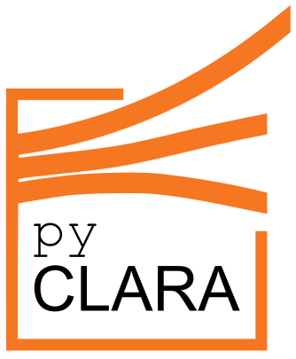

=============
pyCLARA
=============

.. |br| raw:: html

    

|br|

|br|
---------------------------------------------------
python Clustering of Lines And RAsters 
---------------------------------------------------

:Code developers: Kais Siala, Mohammad Youssed Mahfouz, Waleed Sattar Khan, Houssame Houmy
:Documentation authors:	Kais Siala, Waleed Sattar Khan, Houssame Houmy	
:Maintainers: Kais Siala <kais.siala@tum.de>
:Organization: `Chair of Renewable and Sustainable Energy Systems <http://www.ens.ei.tum.de/en/homepage/>`_, Technical University of Munich
:Version: |version|
:Date: |today|
:License:
 The model code is licensed under the `GNU General Public License 3.0  <http://www.gnu.org/licenses/gpl-3.0>`_.  
 This documentation is licensed under a `Creative Commons Attribution 4.0 International <http://creativecommons.org/licenses/by/4.0/>`_ license. 

Features
--------
* Clustering of one or multiple high-resolution rasters, such as wind resource maps or load density maps
* Supported aggregation functions: average, sum, or density
* Combination of k-means and max-p algorithms, to ensure contiguity of the output regions
* Clustering of grid data using a hierarchical algorithm
* Flexibility in the number of polygons obtained

Applications
-------------
This code is useful if:

* You want to obtain regions for energy system models with homogeneous characteristics (e.g. similar wind potential)
* You want to cluster regions based on several characteristics simultaneously
* You want to take into account grid restrictions when defining regions for power system modeling

Related publications
--------------------

* Siala, Kais; Mahfouz, Mohammad Youssef: `Impact of the choice of regions on energy system models <http://doi.org/https://doi.org/10.1016/j.esr.2019.100362>`_. Energy Strategy Reviews 25, 2019, 75-85.

Changes
--------
version 1.0.1
^^^^^^^^^^^^^^
* Adding logo for the tool.
* Minor fixes and improvements.

version 1.0.0
^^^^^^^^^^^^^^
This is the initial version.

Contents
--------
User manual
^^^^^^^^^^^^^

These documents give a general overview and help you get started from the installation to your first running model.

.. toctree::
   :maxdepth: 3
   
   user_manual

Theory documentation
^^^^^^^^^^^^^^^^^^^^

Continue here if you want to understand the concept of the model and learn more about clustering algorithms.

.. toctree::
   :maxdepth: 2

   theory

Technical documentation
^^^^^^^^^^^^^^^^^^^^^^^
Continue here if you want to understand in detail the model implementation.

.. toctree::
   :maxdepth: 2
   
   implementation

Dependencies
------------
A list of the used libraries is available in the environment file:

.. literalinclude:: ../env/geoclustering.yml

Bibliography	
------------

.. toctree::
   :maxdepth: 1
   
   zref

Indices and tables
------------------

* :ref:`genindex`
* :ref:`modindex`
* :ref:`search`
